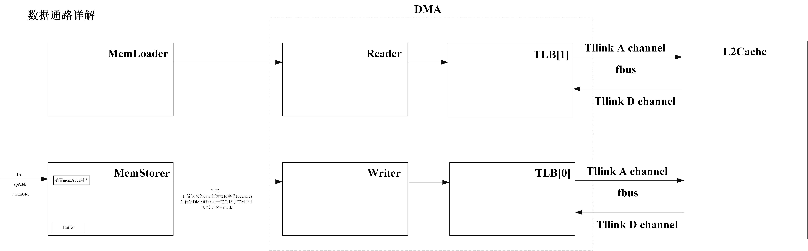
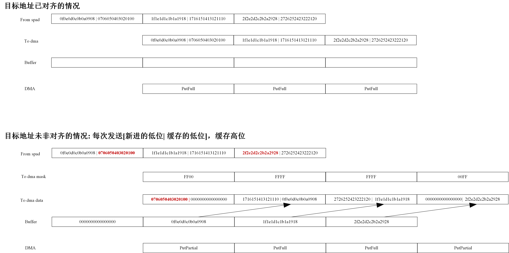

# BuckyBall


BuckyBall is a full-stack open-source NPU/DSA design framework.

## 1. 🤔 Why BuckyBall

> ❗BuckyBall is not a specific NPU design, but a design framework. You can find various NPU design examples in the examples folder.


## 2. Architecture Overview

### 2.1 System Architecture

```
┌─────────────────────────────────────────────────────────┐
│                    Rocket Core                          │
│              (RoCC Interface)                           │
└─────────────────┬───────────────────────────────────────┘
                  │
         ┌────────▼────────┐
         │ Global Decoder  │
         └────────┬────────┘
                  │
         ┌────────▼────────┐
         │   Global RS     │
         │  (with ROB)     │
         └────┬──────┬─────┘
              │      │
      ┌───────▼──┐ ┌▼──────────┐
      │  Ball    │ │   Mem     │
      │  Domain  │ │  Domain   │
      └───┬──────┘ └──────┬────┘
          │               │
      ┌───▼──────────────▼────┐
      │   Memory Controller   │
      │ (Scratchpad + Acc)    │
      └───────────────────────┘
```

### 2.2 ISA Specification

#### 2.2.1 bb_mvin

**Function**: Load data from main memory to scratchpad memory

**func7**: `0010000` (24)

**Format**: `bb_mvin rs1, rs2`

**Operands**:
- `rs1`: Main memory address
- `rs2[spAddrLen-1:0]`: Scratchpad address
- `rs2[spAddrLen+9:spAddrLen]`: Number of rows (iteration count)

**Operation**: Load data from main memory address `rs1` to scratchpad address specified in `rs2`, with iteration count determining number of rows

rs1 format:
```
┌─────────────────────────────────────────────────────────────────┐
│                        mem_addr                                 │
│                    (memAddrLen bits)                            │
├─────────────────────────────────────────────────────────────────┤
│                    [memAddrLen-1:0]                             │
└─────────────────────────────────────────────────────────────────┘
```

rs2 format:
```
┌──────────────────────────────────┬──────────────────────────────────────────┐
│        row (iter)                │                sp_addr                   │
│     (10 bits)                    │            (spAddrLen bits)              │
├──────────────────────────────────┼──────────────────────────────────────────┤
│ [spAddrLen+9:spAddrLen]          │            [spAddrLen-1:0]               │
└──────────────────────────────────┴──────────────────────────────────────────┘
```

#### 2.2.2 bb_mvout

**Function**: Store data from scratchpad memory to main memory

**func7**: `0010001` (25)

**Format**: `bb_mvout rs1, rs2`

**Operands**:
- `rs1`: Main memory address
- `rs2[spAddrLen-1:0]`: Scratchpad address
- `rs2[spAddrLen+9:spAddrLen]`: Number of rows to store (iteration count)

**Operation**: Store data from scratchpad address specified in `rs2` to main memory address `rs1`

rs1 format:
```
┌─────────────────────────────────────────────────────────────────┐
│                        mem_addr                                 │
│                    (memAddrLen bits)                            │
├─────────────────────────────────────────────────────────────────┤
│                    [memAddrLen-1:0]                             │
└─────────────────────────────────────────────────────────────────┘
```

rs2 format:
```
┌──────────────────────────────────┬──────────────────────────────────────────┐
│        row (iter)                │                sp_addr                   │
│     (10 bits)                    │            (spAddrLen bits)              │
├──────────────────────────────────┼──────────────────────────────────────────┤
│   [spAddrLen+9:spAddrLen]        │             [spAddrLen-1:0]              │
└──────────────────────────────────┴──────────────────────────────────────────┘
```

#### 2.2.3 Ball Execution Instructions

**Function**: Execute computation on Ball devices (matrix multiply, transpose, im2col, ReLU, etc.)

**func7**: `0100000` - `0111111` (32-63)

**Format**: `bb_<op> rs1, rs2`

**Common Operands**:
- `rs1[spAddrLen-1:0]`: First operand scratchpad address
- `rs1[2*spAddrLen-1:spAddrLen]`: Second operand scratchpad address
- `rs2[spAddrLen-1:0]`: Result write-back scratchpad address
- `rs2[spAddrLen+9:spAddrLen]`: Iteration count

rs1 format:
```
┌────────────────────────────────┬──────────────────────────────┐
│           op2_spaddr           │          op1_spaddr          │
│       (spAddrLen bits)         │      (spAddrLen bits)        │
├────────────────────────────────┼──────────────────────────────┤
│  [2*spAddrLen-1:spAddrLen]     │ [spAddrLen-1:0]              │
└────────────────────────────────┴──────────────────────────────┘
```

rs2 format:
```
┌──────────────────────────┬────────────────────────────────────┐
│         iter             │    wr_spaddr                       │
│       (10 bits)          │  (spAddrLen bits)                  │
├──────────────────────────┼────────────────────────────────────┤
│ [spAddrLen+9:spAddrLen]  │  [spAddrLen-1:0]                   │
└──────────────────────────┴────────────────────────────────────┘
```

**Supported Operations**:
- Matrix multiplication (various formats: INT8, FP16, FP32, BBFP)
- Transpose operations
- Im2col transformation
- ReLU activation
- Vector operations

### 2.3 Ball Protocol

The Ball protocol defines a unified interface for all computation units in BuckyBall. All Ball devices share common base properties:

**Command Interface**:
```scala
class BallCmd extends Bundle {
  val bid      = UInt(4.W)      // Ball device ID
  val iter     = UInt(10.W)     // Iteration count
  val special  = UInt(40.W)     // Device-specific parameters
}
```

**Common Properties**:
- Unified command/response interface
- ROB ID tracking for out-of-order completion
- Standardized SRAM read/write interfaces
- Configurable iteration support

### 2.4 Memory Hierarchy




**Architecture**:
```
┌──────────────┐
│  Main Memory │
└──────┬───────┘
       │ (DMA + TLB)
┌──────▼────────────────────────────────┐
│      Memory Controller                │
├───────────────────┬───────────────────┤
│   Scratchpad      │   Accumulator     │
│   (4 banks)       │   (8 banks)       │
│   256KB total     │   64KB total      │
└───────────────────┴───────────────────┘
       │                   │
       └────────┬──────────┘
                │
        ┌───────▼─────────┐
        │  Ball Devices   │
        └─────────────────┘
```

**Design Constraints**:
1. All EX instructions' op1 and op2 cannot access the same bank simultaneously
2. All instructions accessing scratchpad must not exceed bank boundaries
3. All banks are single-ported (simultaneous read/write supported, but not to same address)
4. Current bank division: scratchpad has 4 banks (64KB×4), accumulator has 8 banks (8KB×8)
5. Accumulator banks are elastic - CPU can access accumulator banks when needed

### 2.5 Instruction Pipeline

```
┌─────────────────┐
│ RoCC Interface  │
└────────┬────────┘
         │
┌────────▼─────────┐
│ Global Decoder   │  ← Decode instruction type (Ball/Mem/Fence)
└────────┬─────────┘
         │
┌────────▼─────────┐
│   Global RS      │  ← Unified reservation station with ROB
│   (with ROB)     │     - Tracks instruction state
└────┬───────┬─────┘     - Supports out-of-order completion
     │       │
     │       └─────────────┐
┌────▼──────┐     ┌───────▼────────┐
│Ball Domain│     │  Mem Domain    │
│           │     │                │
│ Decoder   │     │   Decoder      │
│    ↓      │     │      ↓         │
│Local FIFO │     │ Local FIFO     │
│    ↓      │     │      ↓         │
│Ball Devices│    │MemLoader/Storer│
└───────────┘     └────────────────┘
```

**Pipeline Stages**:
1. **Global Decoder**: Classify instruction type (Ball/Memory/Fence)
2. **Global RS**: Allocate ROB entry and issue to appropriate domain
3. **Domain Decoder**: Decode domain-specific instruction details
4. **Local RS/FIFO**: Buffer and issue to execution units when ready
5. **Execution**: Perform computation or memory operation
6. **Completion**: Report to Global RS for ROB commit

### 2.6 Configuration Parameters

**Default Configuration** (defined in `BaseConfig`):
- **Vector Lane**: 16 elements per vector operation
- **ROB Entries**: 16 (supports up to 16 in-flight instructions)
- **Scratchpad**: 256KB (4 banks × 64KB)
- **Accumulator**: 64KB (8 banks × 8KB)
- **DMA Bus Width**: 128 bits
- **Address Lengths**:
  - spAddrLen: 15 bits (supports SPAD + ACC indexing)
  - memAddrLen: 32 bits (4GB address space)


- Scala 2.13+
- Mill build tool
- Verilator (for simulation)


### Directory Structure

```
arch/
├── src/main/scala/
│   ├── examples/          # Example configurations and systems
│   │   └── toy/          # Toy example system
│   ├── framework/        # Core framework
│   │   ├── builtin/     # Built-in components
│   │   │   ├── frontend/  # Global decoder, RS, ROB
│   │   │   └── memdomain/ # Memory domain components
│   │   └── blink/       # Ball protocol definitions
│   └── prototype/       # Prototype Ball devices
│       ├── matrix/      # Matrix computation Balls
│       ├── vector/      # Vector computation Balls
│       ├── transpose/   # Transpose Ball
│       ├── im2col/      # Im2col Ball
│       └── relu/        # ReLU Ball
└── sims/               # Simulation environments
    ├── verilator/      # Verilator simulation
    └── firesim/        # FireSim FPGA simulation
```

## 4. Documentation

- [Framework Overview](src/main/scala/framework/README.md) - Core framework architecture
- [Examples](src/main/scala/examples/README.md) - Example configurations
- [Prototype Balls](src/main/scala/prototype/README.md) - Ball device implementations
- [Memory Domain](src/main/scala/framework/builtin/memdomain/README.md) - Memory subsystem
- [Simulation Guide](src/main/scala/sims/README.md) - Simulation setup

## 5. Contributing

We welcome contributions! Please see our contributing guidelines and feel free to submit issues and pull requests.

## 6. License

