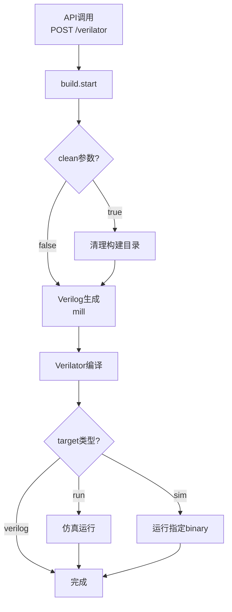

# Verilator Build Workflow

Verilator 工具相关的工作流

## 一、API使用说明

### 基础API

**端点**: `POST /verilator`

**功能**: 触发Verilator构建和仿真流程

### API Target 及其参数

#### 1. `run` - 完整构建和仿真

**功能**: 执行完整流程。生成Verilog，然后编译Verilator为仿真文件，并直接运行仿真

**参数**:

- **`jobs`** - 并行编译任务数
  - 默认值: `16`

**示例**:
```bash
curl -X POST http://localhost:5000/verilator -d '{"target": "run", "jobs": 8}'
```

#### 2. `build` 

**功能**: 将verilog源文件和cpp源文件编译为可执行仿真文件

**参数**: 

- **`jobs`** - 并行编译任务数
  - 默认值: `16`

**示例**:
```bash
curl -X POST http://localhost:5000/verilator -d '{"target": "build"}'
```

#### 3. `verilog` 

**功能**: 仅生成Verilog代码，不进行编译和仿真

**参数**: 无

**示例**:
```bash
curl -X POST http://localhost:5000/verilator -d '{"target": "verilog"}'
```

#### 4. `sim` 

**功能**: 运行已存在的仿真可执行文件

**参数**:

- **`binary`**[必选] - 自定义测试二进制文件路径
  - 默认值: `""`

**示例**:
```bash
curl -X POST http://localhost:5000/verilator -d '{"target": "sim", "binary": "/home/user/test_program.elf"}'
```

#### 5. `clean` - 清空build文件夹

**功能**: 清空build文件夹

**参数**: 无

**示例**:
```bash
curl -X POST http://localhost:5000/verilator -d '{"target": "clean"}'
```


## 二、开发者文档

### 目录结构

```
steps/verilator/
├── 00_start_node_noop_step.py      # 工作流入口节点定义
├── 00_start_node_noop_step.tsx     # 前端UI组件
├── 01_build_verilator_api_step.py  # API入口处理
├── 02_clean_event_step.py          # 清理构建目录
├── 03_verilog_event_step.py        # Verilog代码生成
├── 04_build_event_step.py          # Verilator编译
├── 05_sim_event_step.py            # 仿真运行
└── README.md                        # 本文档
```

### 工作流步骤详解

#### 1. 入口节点 (`00_start_node_noop_step.py`)
- **类型**: `noop` 节点
- **功能**: 定义工作流入口，虚拟订阅空事件，虚拟发出 `/verilator` 事件
- **前端**: 提供"Start Build Verilator"按钮触发工作流

#### 2. API入口 (`01_build_verilator_api_step.py`)
- **类型**: `api` 步骤
- **路径**: `/verilator`
- **方法**: `POST`
- **功能**: 
  - 接收HTTP请求并解析参数
  - 验证和设置默认值
  - 发出 `build.start` 事件
- **发出事件**: `build.start`

#### 3. 清理步骤 (`02_clean_event_step.py`)
- **类型**: `event` 步骤
- **订阅**: `build.start`
- **功能**: 
  - 根据 `clean` 参数决定是否清理
  - 删除 `arch/build` 目录
  - 自动触发下一步
- **发出事件**: `build.verilog` 或 `build.error`

#### 4. Verilog生成 (`03_verilog_event_step.py`)
- **类型**: `event` 步骤
- **订阅**: `build.verilog`
- **功能**: 
  - 使用mill生成Verilog代码
  - 输出到 `arch/build` 目录
  - 清理临时文件
  - 如果目标是仿真，触发Verilator编译
- **发出事件**: `build.verilator` 或 `build.error`

#### 5. Verilator编译 (`04_build_event_step.py`)
- **类型**: `event` 步骤
- **订阅**: `build.verilator`
- **功能**: 
  - 自动查找所有Verilog和C++源文件
  - 设置include路径和链接库
  - 调用verilator编译
  - 生成可执行文件 `VTestHarness`
- **发出事件**: `build.sim` 或 `build.error`

#### 6. 仿真运行 (`05_sim_event_step.py`)
- **类型**: `event` 步骤
- **订阅**: `build.sim`
- **功能**: 
  - 运行Verilator仿真
  - 支持自定义binary参数
  - 设置仿真参数和日志目录
- **发出事件**: `build.complete` 或 `build.error`

### 工作流程图


