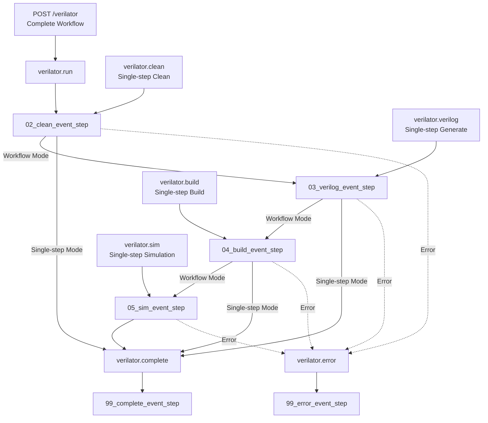

# Verilator Simulation Workflow

Hardware simulation workflow based on Verilator in the BuckyBall framework, providing a complete automation flow from RTL generation to simulation execution. Verilator is a high-performance Verilog simulator that supports fast functional verification and performance analysis.

## II. Original API Usage Guide

#### `run`
**Endpoint**: `POST /verilator/run`

**Function**: Execute complete workflow. Clean build directory, generate Verilog, compile Verilator into simulation file, and run simulation directly

**Parameters**:

- **`jobs`** - Number of parallel compilation tasks
  - Default value: `16`
- **`binary`** [Required] - Test binary file path
  - Default value: `""`

**Example**:
```bash
# bbdev wrapper
bbdev verilator --run "jobs 256 --binary ${buckyball}/bb-tests/workloads/build/src/CTest/ctest_mvin_mvout_alternate_test_singlecore-baremetal --batch"

# Raw command
curl -X POST http://localhost:5000/verilator/run -H "Content-Type: application/json" -d '{"jobs": 8, "binary": "/home/user/test.elf"}'
```


#### `clean`

**Endpoint**: `POST /verilator/clean`

**Function**: Clean build folder

**Parameters**: None

**Example**:
```bash
curl -X POST http://localhost:5000/verilator/clean
```

#### `verilog`

**Endpoint**: `POST /verilator/verilog`

**Function**: Only generate Verilog code, without compilation and simulation

**Parameters**: None

**Example**:
```bash
curl -X POST http://localhost:5000/verilator/verilog -d '{"jobs": 8}'
```

#### `build`

**Endpoint**: `POST /verilator/build`

**Function**: Compile verilog source files and cpp source files into executable simulation file

**Parameters**:

- **`jobs`** - Number of parallel compilation tasks
  - Default value: `16`

**Example**:
```bash
curl -X POST http://localhost:5000/verilator/build -d '{"jobs": 16}'
```

#### `sim`

**Endpoint**: `POST /verilator/sim`

**Function**: Run existing simulation executable

**Parameters**:

- **`binary`** [Required] - Custom test binary file path

**Example**:
```bash
curl -X POST http://localhost:5000/verilator/sim \
  -H "Content-Type: application/json" \
  -d '{"binary": "/home/user/test_program.elf"}'
```


## II. Developer Documentation

### Directory Structure

```
steps/verilator/
├── 00_start_node_noop_step.py      # Workflow entry node definition
├── 00_start_node_noop_step.tsx     # Frontend UI component
├── 01_run_api_step.py              # Complete workflow API entry
├── 01_clean_api_step.py            # Clean API endpoint
├── 01_verilog_api_step.py          # Verilog generation API endpoint
├── 01_build_api_step.py            # Build API endpoint
├── 01_sim_api_step.py              # Simulation API endpoint
├── 02_clean_event_step.py          # Clean build directory
├── 03_verilog_event_step.py        # Verilog code generation
├── 04_build_event_step.py          # Verilator compilation
├── 05_sim_event_step.py            # Simulation execution
├── 99_complete_event_step.py       # Completion handling
├── 99_error_event_step.py          # Error handling
└── README.md                       # This document
```

### Workflow Steps Detailed

#### 1. Entry Node (`00_start_node_noop_step.py`)
- **Type**: `noop` node
- **Function**: Provide UI interface entry point
- **Frontend**: "Start Build Verilator" button

#### 2. API Endpoints
- **Complete Workflow API** (`01_run_api_step.py`): `/verilator` → `verilator.run`
- **Clean API** (`01_clean_api_step.py`): `/verilator/clean` → `verilator.clean`
- **Verilog Generation API** (`01_verilog_api_step.py`): `/verilator/verilog` → `verilator.verilog`
- **Build API** (`01_build_api_step.py`): `/verilator/build` → `verilator.build`
- **Simulation API** (`01_sim_api_step.py`): `/verilator/sim` → `verilator.sim`

#### 3. Clean Step (`02_clean_event_step.py`)
- **Type**: `event` step
- **Subscribes**: `verilator.run`, `verilator.clean`
- **Emits**: `verilator.verilog`, `verilator.complete`
- **Function**: Delete build directory, serves workflow or standalone operation

#### 4. Verilog Generation (`03_verilog_event_step.py`)
- **Type**: `event` step
- **Subscribes**: `verilator.verilog`
- **Emits**: `verilator.build`, `verilator.complete`
- **Function**: Use mill to generate Verilog code to build directory

#### 5. Verilator Compilation (`04_build_event_step.py`)
- **Type**: `event` step
- **Subscribes**: `verilator.build`
- **Emits**: `verilator.sim`, `verilator.complete`
- **Function**: Compile Verilog and C++ source files into executable simulation file

#### 6. Simulation Execution (`05_sim_event_step.py`)
- **Type**: `event` step
- **Subscribes**: `verilator.sim`
- **Emits**: `verilator.complete`
- **Function**: Run simulation, supports custom binary parameter

#### 7. Completion Handling (`99_complete_event_step.py`)
- **Type**: `event` step
- **Subscribes**: `verilator.complete`
- **Function**: Print success message, mark workflow as complete

#### 8. Error Handling (`99_error_event_step.py`)
- **Type**: `event` step
- **Subscribes**: `verilator.error`
- **Function**: Print error message, handle workflow exceptions

### Workflow Diagram


