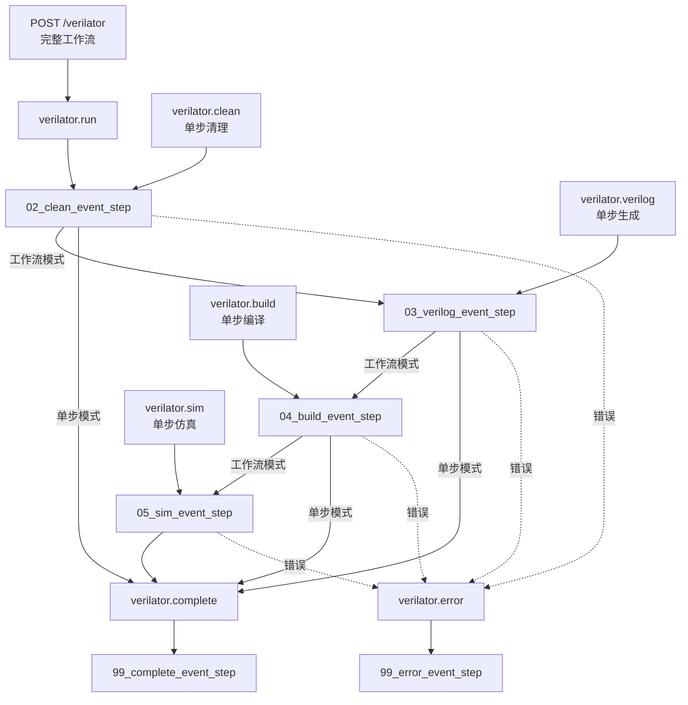

# Verilator Build Workflow

Verilator 工具相关的工作流

## 一、bbdev封装后API使用说明


## 二、原始API使用说明

#### `run` 
**端点**: `POST /verilator/run`

**功能**: 执行完整流程。清理build目录，生成Verilog，然后编译Verilator为仿真文件，并直接运行仿真

**参数**:

- **`jobs`** - 并行编译任务数
  - 默认值: `16`
- **`binary`** [必选] - 测试二进制文件路径
  - 默认值: `""`

**示例**:
```bash
curl -X POST http://localhost:5000/verilator/run -H "Content-Type: application/json" -d '{"jobs": 8, "binary": "/home/user/test.elf"}'
```


#### `clean` 

**端点**: `POST /verilator/clean`

**功能**: 清空build文件夹

**参数**: 无

**示例**:
```bash
curl -X POST http://localhost:5000/verilator/clean
```

#### `verilog` 

**端点**: `POST /verilator/verilog`

**功能**: 仅生成Verilog代码，不进行编译和仿真

**参数**: 无

**示例**:
```bash
curl -X POST http://localhost:5000/verilator/verilog -d '{"jobs": 8}'
```

#### `build` 

**端点**: `POST /verilator/build`

**功能**: 将verilog源文件和cpp源文件编译为可执行仿真文件

**参数**: 

- **`jobs`** - 并行编译任务数
  - 默认值: `16`

**示例**:
```bash
curl -X POST http://localhost:5000/verilator/build -d '{"jobs": 16}'
```

#### `sim` 

**端点**: `POST /verilator/sim`

**功能**: 运行已存在的仿真可执行文件

**参数**:

- **`binary`**[必选] - 自定义测试二进制文件路径

**示例**:
```bash
curl -X POST http://localhost:5000/verilator/sim \
  -H "Content-Type: application/json" \
  -d '{"binary": "/home/user/test_program.elf"}'
```


## 二、开发者文档

### 目录结构

```
steps/verilator/
├── 00_start_node_noop_step.py      # 工作流入口节点定义
├── 00_start_node_noop_step.tsx     # 前端UI组件
├── 01_run_api_step.py              # 完整工作流API入口
├── 01_clean_api_step.py            # 清理API端点
├── 01_verilog_api_step.py          # Verilog生成API端点
├── 01_build_api_step.py            # 编译API端点
├── 01_sim_api_step.py              # 仿真API端点
├── 02_clean_event_step.py          # 清理构建目录
├── 03_verilog_event_step.py        # Verilog代码生成
├── 04_build_event_step.py          # Verilator编译
├── 05_sim_event_step.py            # 仿真运行
├── 99_complete_event_step.py       # 完成处理
├── 99_error_event_step.py          # 错误处理
└── README.md                       # 本文档
```

### 工作流步骤详解

#### 1. 入口节点 (`00_start_node_noop_step.py`)
- **类型**: `noop` 节点
- **功能**: 提供UI界面入口
- **前端**: "Start Build Verilator"按钮

#### 2. API端点
- **完整工作流API** (`01_run_api_step.py`): `/verilator` → `verilator.run`
- **清理API** (`01_clean_api_step.py`): `/verilator/clean` → `verilator.clean`
- **Verilog生成API** (`01_verilog_api_step.py`): `/verilator/verilog` → `verilator.verilog`
- **编译API** (`01_build_api_step.py`): `/verilator/build` → `verilator.build`
- **仿真API** (`01_sim_api_step.py`): `/verilator/sim` → `verilator.sim`

#### 3. 清理步骤 (`02_clean_event_step.py`)
- **类型**: `event` 步骤
- **订阅**: `verilator.run`, `verilator.clean`
- **发出**: `verilator.verilog`, `verilator.complete`
- **功能**: 删除build目录，为工作流或单独操作服务

#### 4. Verilog生成 (`03_verilog_event_step.py`)
- **类型**: `event` 步骤
- **订阅**: `verilator.verilog`
- **发出**: `verilator.build`, `verilator.complete`
- **功能**: 使用mill生成Verilog代码到build目录

#### 5. Verilator编译 (`04_build_event_step.py`)
- **类型**: `event` 步骤
- **订阅**: `verilator.build`
- **发出**: `verilator.sim`, `verilator.complete`
- **功能**: 编译Verilog和C++源文件为可执行仿真文件

#### 6. 仿真运行 (`05_sim_event_step.py`)
- **类型**: `event` 步骤
- **订阅**: `verilator.sim`
- **发出**: `verilator.complete`
- **功能**: 运行仿真，支持自定义binary参数

#### 7. 完成处理 (`99_complete_event_step.py`)
- **类型**: `event` 步骤
- **订阅**: `verilator.complete`
- **功能**: 打印成功消息，标记工作流完成

#### 8. 错误处理 (`99_error_event_step.py`)
- **类型**: `event` 步骤
- **订阅**: `verilator.error`
- **功能**: 打印错误消息，处理工作流异常

### 工作流程图


